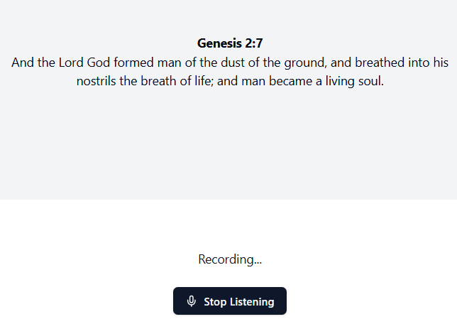

# Describtion of work

- I used deepgram listening model, they have free api for speech to text, I used it to convert the audio to text. Since working with the web Media APIs was a bit tricky for the short period of time.
- I used Laravel with Inertia vue.
- Another api I used was groq, I utilized it to extract the verses from the transcribed text using both system and user prompts and then transforming that text into a laravel eloquent query for querying the database.
- Since the llm is not always guaranteeing a structured output and php doesn't have libraries like pydantic for python I used regext to extract the eloquents queries generated by the llm just to make sure i'm enforcing a structured output.
- I've also run a couple of the bibles in the database but due to time i could not capture all the different translations
- Also I only made use of King James Version since creating a model for each table representing a bible translation would be a bit overkill for the short period of time.
- I've also added a couple of tests for the api endpoints.

# How to run the project

- Clone the project
- Run `composer install`
- Run `npm install`
- Run `npm run dev`
- Run `php artisan serve`
- Visit `http://localhost:8000` in your browser
- Run `php artisan reverb:start` to start the listening service
- get a free groq api key from https://console.groq.com/ and add it to the .env file
- I have left the deepgram api key on the client side for easy use due to time (but that I know that is a potential security risk)
- Run `php artisan test` to run the tests
